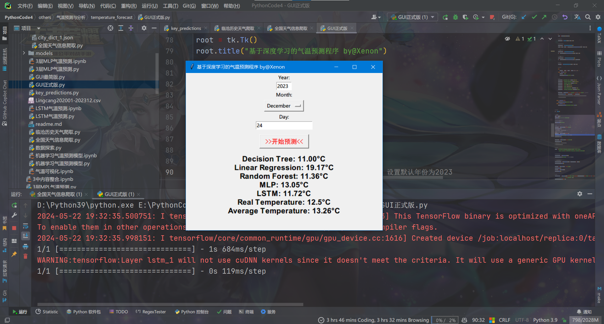
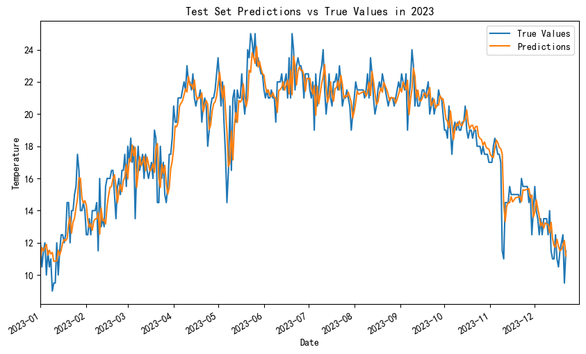
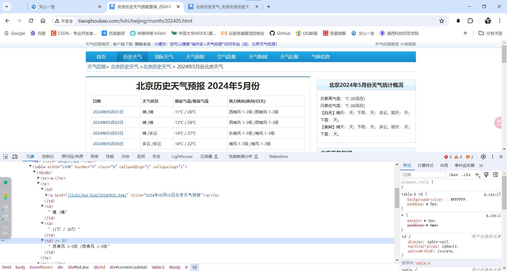
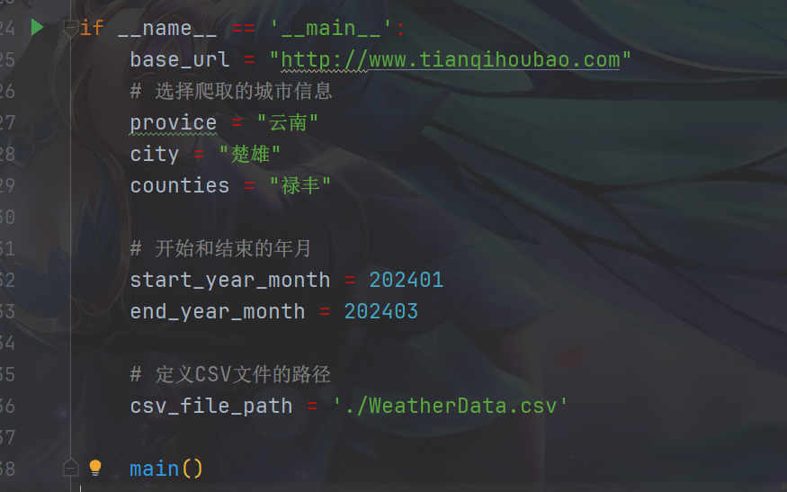
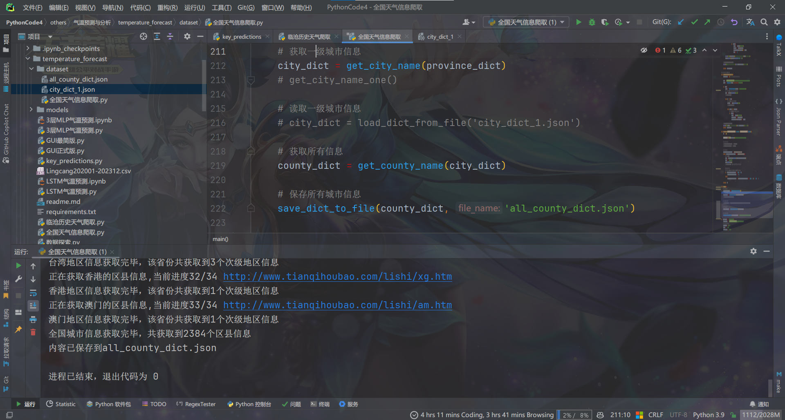
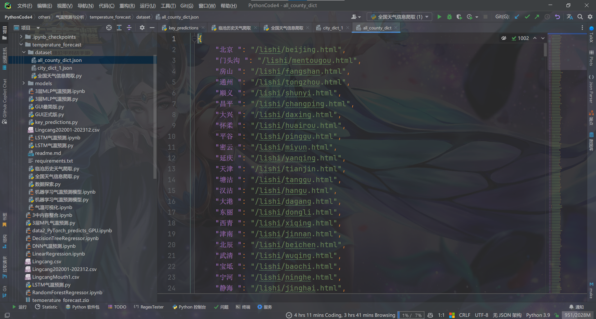
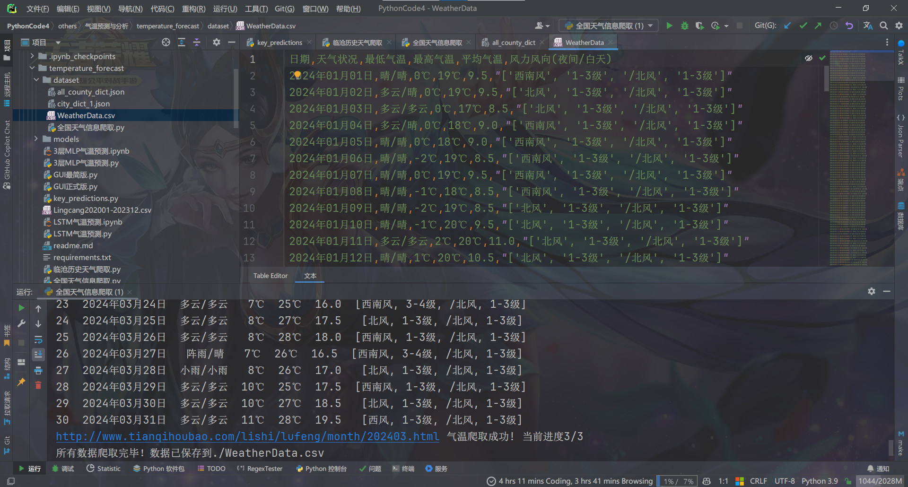
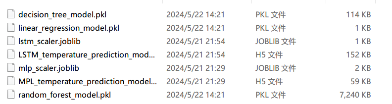
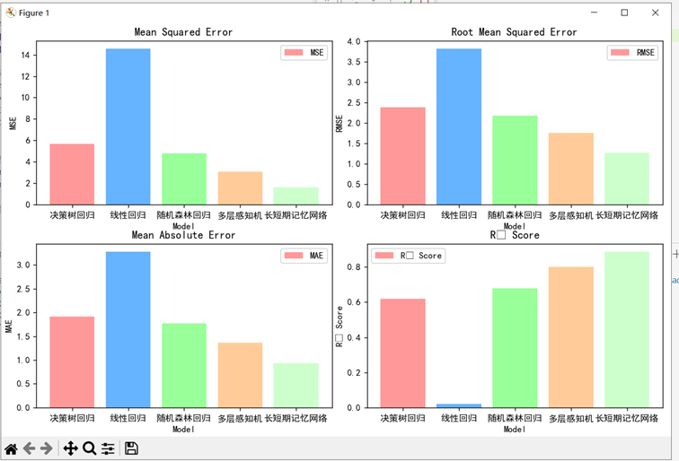
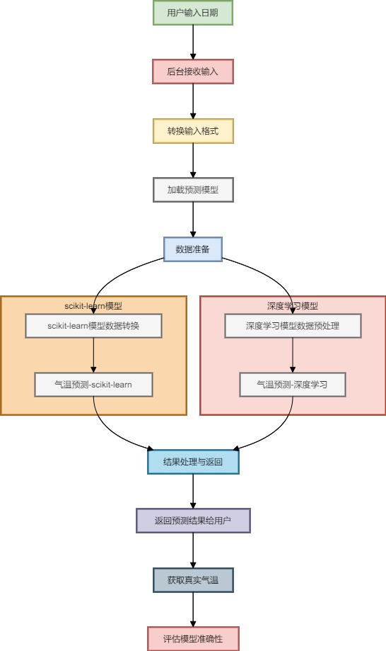

# 5种方法完成气温预测与分析

三层感知机MLP、长短期记忆网络（LSTM）、随机森林回归、决策树回归以及线性回归

爬取全国各地气温数据相关信息

## 摘要

利用深度学习技术，致力于气温变化的预测与分析。为实现这一目标，构建了五种回归模型进行系统地对比分析，分别是三层感知机MLP、长短期记忆网络（LSTM）、随机森林回归、决策树回归以及线性回归，以期全面探究各种模型在气温预测中的准确性。经过严格的模型训练，深入剖析了各模型在气温预测任务中的性能差异。综合考量预测效果和准确率等关键指标，研究结果显示长短期记忆网络（LSTM）在性能和准确率上均表现最佳。同时，为方便用户直观查看预测结果，本文还特别开发了一款图形化用户界面（GUI），从而实现了气温预测结果的可视化展示。

运行:

```
python key_predictions.py
```

ps: requirements.txt中包仅供参考,不需要全部安装,个人电脑未区分环境.

最终结果如下图:





**技术路线**

第一种采用了随机森林回归技术。这一技术的核心是利用多个决策树构建一个集成学习模型。通过平均多个决策树的预测结果，不仅能够捕捉数据中的非线性关系，还能有效减少过拟合的风险，从而提高了气温预测的准确性。

第二种运用了线性回归方法。通过使用最小二乘法，拟合了一条直线，以描述气温与时间之间的线性关系。这种方法能够对气温变化进行线性的、直观的预测。

第三种借助了决策树回归。这种方法基于树形结构进行决策和预测，树中的每个节点代表一个特征的判断条件，而每个分支则代表一个可能的输出。通过构建决策树，模型能够自动选择最重要的特征进行分裂，从而揭示数据中的潜在规律和关联，为气温预测提供了直观且易于解释的结果。

然后，使用了多层感知机（MLP，Multilayer Perceptron） 对气温的预测。MLP是一种前馈人工神经网络，它通过多层神经元的连接和激活函数的非线性变换，能够学习并逼近复杂的非线性关系。利用MLP的强大学习能力，成功地捕捉到了气温数据中的高度非线性模式，从而显著提升了预测的准确性和模型的泛化能力。

ps:使用的数据集仅包含一个特征(标签), 一个标签(平均温度). LSTM使用前7天气温进行预测.

## 数据集获取

网站: http://www.tianqihoubao.com/



使用爬虫进行爬取,代码见"\temperature_forecast\dataset\全国天气信息爬取.py"

全国所有区县信息已保存为 "all_county_dict.json" 文件,直接读取与base_url拼接即可.

指定地区获取请更改下文内容:



该网站支持全国各地共2384个区县级地区历史气温查询





运行该文件可以获取某一地区某一段时间区间是数据集.



## 文件说明

模型搭建与训练:

+ 3层MLP气温预测.ipynb

+ LSTM气温预测.ipynb

+ 机器学习气温预测模型.ipynb

顶层函数:

+ key_predictions.py

GUI界面:

+ GUI正式版.py

模型文件:

+ 


## 模型评估



## GUI界面逻辑




Author: yxn4065@qq.com

blog: https://blog.csdn.net/yxn4065
